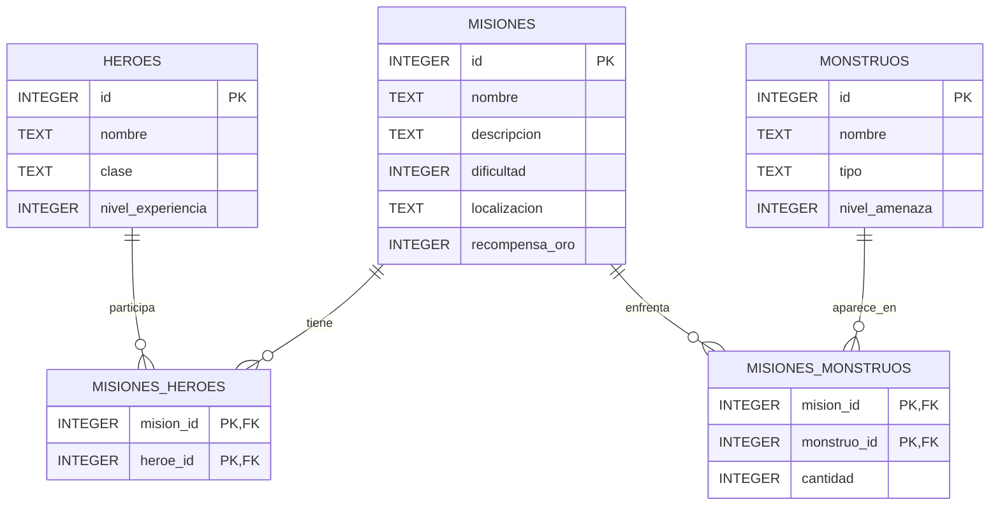

# Gremio de Aventureros (Python + SQLite)

Aplicación de línea de comandos que administra la base de datos de un gremio de aventureros: **héroes**, **misiones** y **monstruos**, con las relaciones muchos-a-muchos entre misiones y héroes y entre misiones y monstruos. Usa la biblioteca estándar `sqlite3` de Python.

## Funcionalidades

- **Héroes, misiones y monstruos:** agregar, listar, actualizar y eliminar (en la actualización, Enter conserva el valor actual).
- **Participantes y enemigos:** registrar o quitar héroes y monstruos de una misión (los monstruos con su cantidad).
- **Consultas y reportes:**
  - Reporte completo héroe - misión - monstruo (JOIN de las 5 tablas)
  - Detalle de una misión (héroes y monstruos)
  - Misiones de un héroe
  - Oro acumulado por héroe (`LEFT JOIN` + `GROUP BY`)
  - Héroes sin misiones
- **Datos de ejemplo:** opción del menú para cargar un conjunto de prueba.

## Estructura del proyecto

| Archivo | Responsabilidad |
|---|---|
| `database.py` | Todo el SQL: creación de tablas, operaciones sobre cada entidad, tablas puente y reportes |
| `main.py` | Interfaz de consola: menús, validación de entradas y presentación de tablas |
| `gremio.db` | Base de datos (se crea sola en la primera ejecución) |

## Modelo lógico

| Tabla | Columnas | Restricciones principales |
|---|---|---|
| `heroes` | id, nombre, clase, nivel_experiencia | `clase` en lista cerrada; `nivel_experiencia >= 1` |
| `misiones` | id, nombre, descripcion, dificultad, localizacion, recompensa_oro | `dificultad` entre 1 y 10; `recompensa_oro >= 0` |
| `monstruos` | id, nombre, tipo, nivel_amenaza | `tipo` en lista cerrada; `nivel_amenaza` entre 1 y 10 |
| `misiones_heroes` | mision_id, heroe_id | PK compuesta; FK con `ON DELETE CASCADE` |
| `misiones_monstruos` | mision_id, monstruo_id, cantidad | PK compuesta; `cantidad >= 1`; FK a monstruos con `ON DELETE RESTRICT` |

## Modelo entidad-relación



GitHub muestra este diagrama automáticamente; también puedes pegarlo en mermaid.live.

## Requisitos

- Python 3.8 o superior
- Sin dependencias externas (`sqlite3` viene incluido con Python)

## Ejecución

1. Guarda `main.py` y `database.py` en la **misma carpeta**.
2. Abre una terminal en esa carpeta y ejecuta:

```bash
python main.py
```

(En Mac o Linux, `python3 main.py`.)

3. Para probar rápido, elige la opción **6** (Cargar datos de ejemplo) y luego la **5** (Consultas y reportes).

## Notas técnicas

- **Claves foráneas:** SQLite las trae desactivadas por defecto. `conectar()` ejecuta `PRAGMA foreign_keys = ON` en cada conexión; sin eso no se aplicarían.
- **Integridad:** los `CHECK`, las PK compuestas y las FK se hacen cumplir en la base de datos; el programa además valida las entradas antes de enviarlas. Si una restricción se viola (héroe repetido en una misión, id inexistente, borrar un monstruo usado), se muestra un mensaje en vez de cerrar el programa.
- **`CASCADE` vs `RESTRICT`:** al borrar un héroe o una misión se eliminan sus filas de las tablas puente; borrar un monstruo que aparece en alguna misión se bloquea para conservar el historial.
- **Seguridad:** todas las consultas usan parámetros (`?`).

## Captura del programa (opcional)

Agrega aquí una captura de pantalla de la aplicación en uso.
